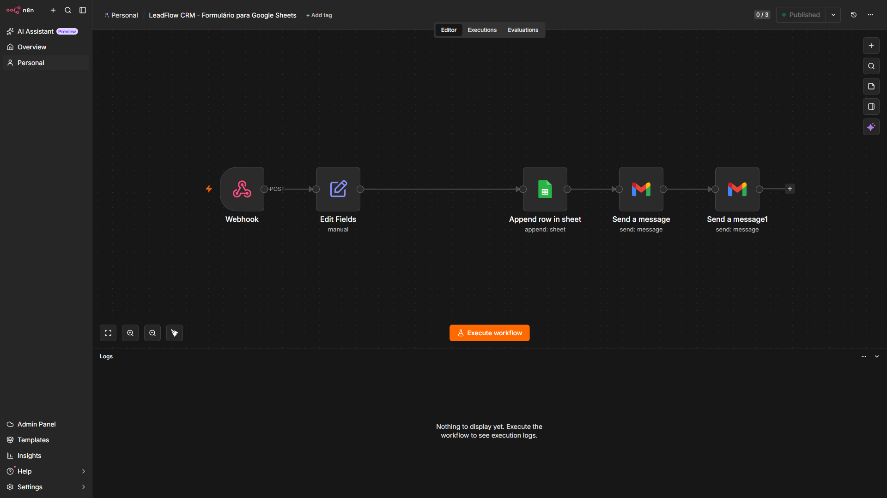
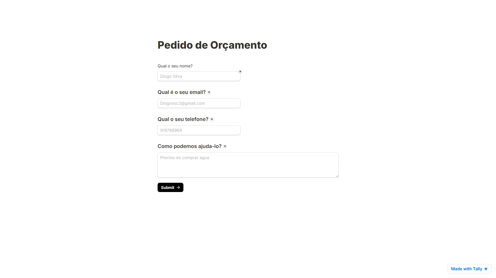
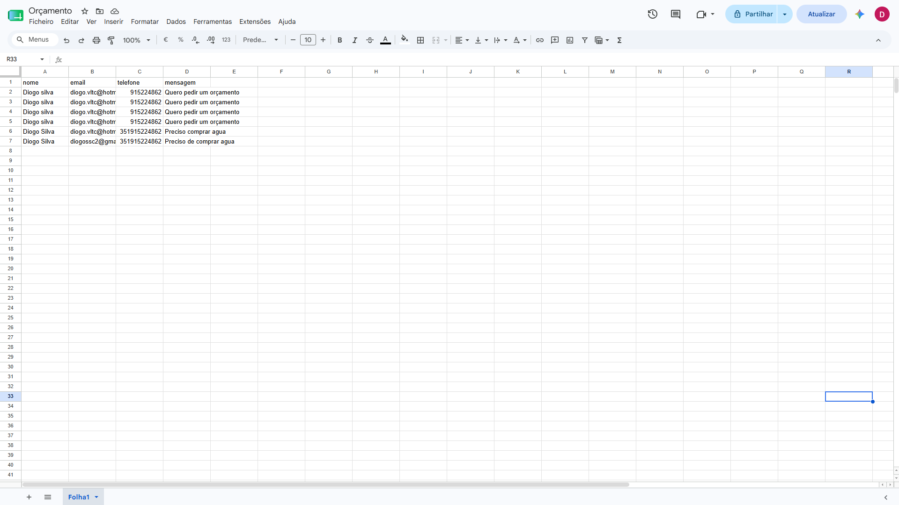
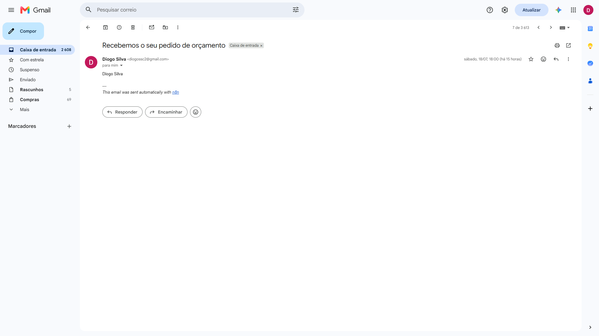
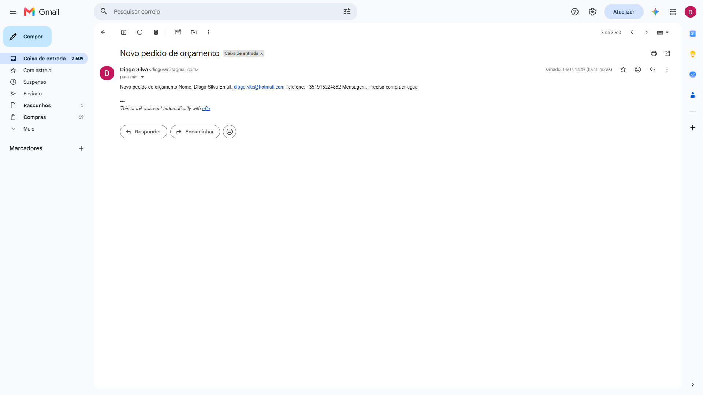

# LeadFlow CRM

## Overview

LeadFlow CRM is an automation workflow built with n8n that captures leads from a Tally form, stores them in Google Sheets, and automatically sends email notifications.

## Features

- Capture leads from Tally
- Process data with n8n
- Store information in Google Sheets
- Send confirmation email to the customer
- Send notification email to the business owner

## Tech Stack

- n8n
- Tally
- Google Sheets
- Gmail

## Workflow

Tally Form
    ↓
Webhook
    ↓
Edit Fields
    ↓
Google Sheets
    ↓
Customer Email
    ↓
Business Notification
```

## Status

✅ Completed

## Screenshots

### Workflow



### Tally Form



### Google Sheets



### Customer Email



### Business Notification

